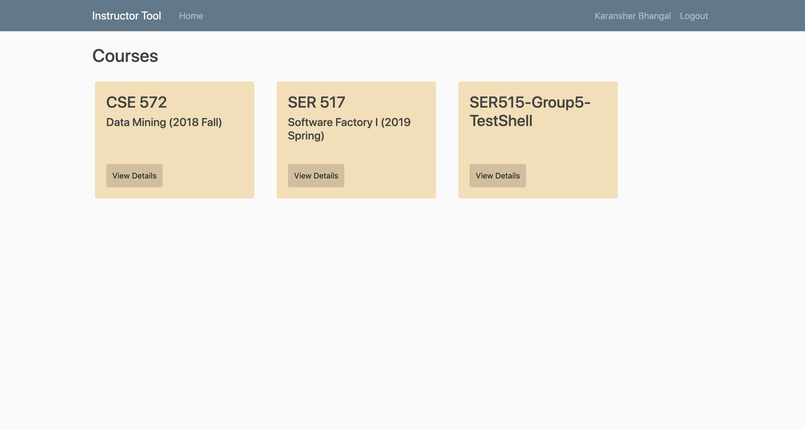
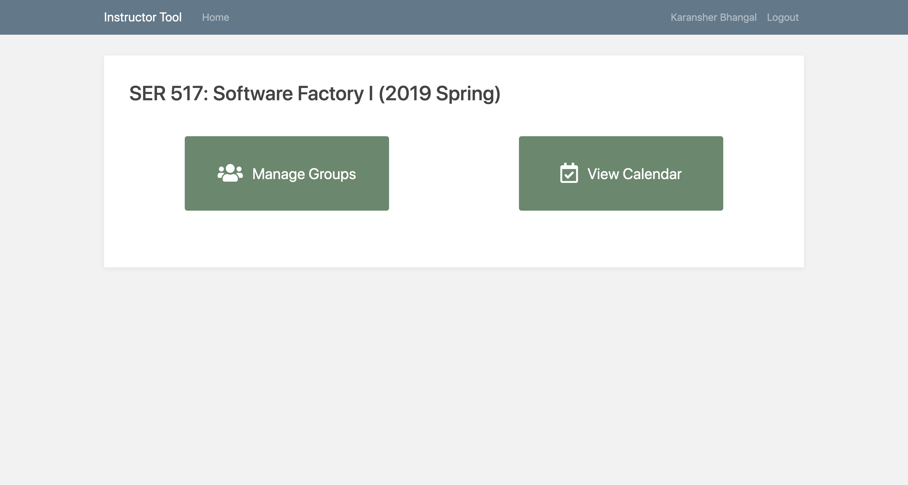
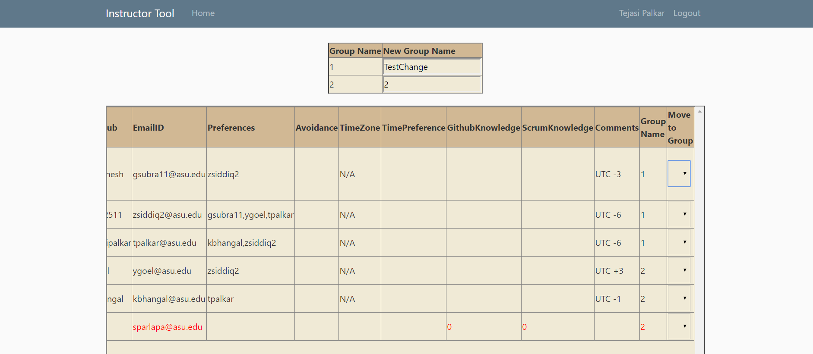
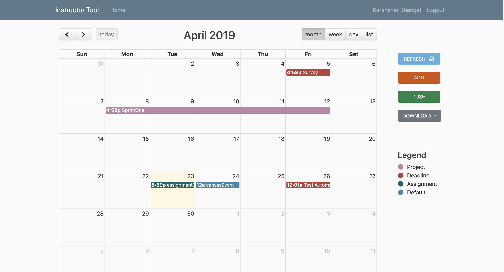

# Instructor-tool-for-team-based-courses

## Overview

The project is about a web based tool that assists instructors in performing various tedious manual tasks like asking the students to fill out a survey, create groups based on the preferences mentioned by the students and setup GitHub, Taiga, slack for these individual groups. The tool is in-built  with all the above features and some more which reduces manual workload of the instructor and saves time. The instructor using the tool can also use Planning Calendar and export feature to generate the calendar schedule in a latex format.

## Dependencies

- PyJWT==1.7.1
- canvasapi==0.11.0
- Flask==1.0.2
- Flask-Cors==3.0.7
- Flask-Login==0.4.1
- Flask-SQLAlchemy==2.3.2
- Flask-WTF==0.14.2
- pandas==0.23.4
- idna==2.7
- itsdangerous==1.1.0
- Jinja2==2.10
- MarkupSafe==1.1.0
- numpy==1.15.4
- python-dateutil==2.7.5
- python-taiga==0.9.0
- pytz==2018.7
- requests==2.20.1
- six==1.11.0
- SQLAlchemy==1.2.14
- urllib3==1.24.1
- Werkzeug==0.14.1
- WTForms==2.2.1

## Screenshots

Main Page

Course Page

Groups Page

Calendar

## Contributors

These people are associated with the development of the InstructorTool:

- [Ganesh Kumar S V](https://github.com/svganesh)
- [Karansher Bhangal](https://github.com/kbhangal)
- [Tejasi Palkar](https://github.com/tejasipalkar)
- [Yathartha Goel](https://github.com/ygoel)
- [Zain Siddiqui](https://github.com/zain2511)
- [Suman Parlapalli](https://github.com/sumanparlapapalli)
